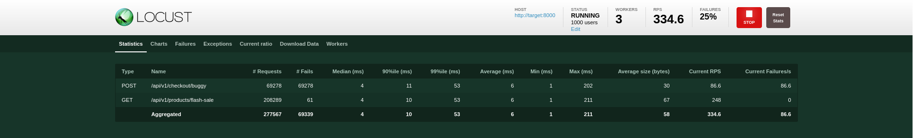
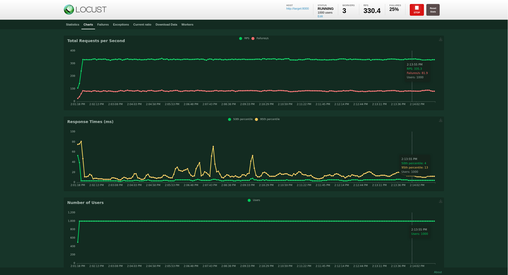
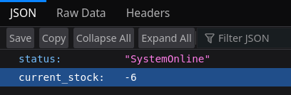

# ⚡ Distributed Flash Sale Load Test (PoC)


## 🎯 Overview

This project is a **Proof of Concept (PoC)** to demonstrate and solve a critical backend vulnerability: **Race Condition (Overselling)** during high-traffic events.

In a real-world Flash Sale, thousands of users hit the "Buy" button simultaneously. Without proper concurrency handling, a standard application will sell more inventory than available, causing financial loss and data corruption.

**Objective:**
To prove that a server with 100% uptime (HTTP 200 OK) can still fail in Data Integrity (Stock becomes -6), and how to fix it using **Mutex Locking**.

---

## 🏗️ System Architecture

The project simulates a distributed environment using **Docker Compose**:

* **Target Service (FastAPI):** A backend service with simulated database latency to trigger race conditions.
* **Locust Master:** Orchestrates the load test.
* **Locust Workers (x3):** Generates high-concurrency traffic (1000+ Concurrent Users).

---

## 🧪 The Experiments

I implemented 3 distinct API endpoints to compare different architectural approaches:

### 1. The Vulnerable Endpoint (Race Condition)
* **Endpoint:** `POST /api/v1/checkout/buggy`
* **Logic:** A naive `if stock > 0` check without locking.
* **Result:** **FAILED**. The system oversold the inventory.
* **Final Stock:** **Negative (e.g., -6)**.

### 2. The Unstable Endpoint (Chaos Engineering)
* **Endpoint:** `POST /api/v1/checkout/unstable`
* **Logic:** Same as above, but injects **5% random HTTP 503 errors**.
* **Goal:** To test system resilience against random server failures.

### 3. The Thread-Safe Endpoint (Fixed)
* **Endpoint:** `POST /api/v1/checkout/safe`
* **Logic:** Uses **Mutex Lock (`threading.Lock`)** to ensure atomicity.
* **Result:** **PASSED**. Zero overselling.
* **Final Stock:** **Exactly 0**.

---

## 📸 Proof of Concept (Results)

### Evidence A: High Traffic Load
Simulating **1000 Concurrent Users** attacking the checkout endpoint.
 

### Evidence B: The Race Condition Bug
Despite having only 100 items, the "Buggy" implementation allowed 106 users to checkout successfully.


---

## 🚀 How to Run

**Prerequisites:** Docker & Docker Compose.

1.  **Clone the repository**
    ```bash
    git clone [https://github.com/theodoreraff/distributed-flashsale-loadtest.git](https://github.com/your-username/distributed-flashsale-loadtest.git)
    cd distributed-flashsale-loadtest
    ```

2.  **Start the Environment**
    ```bash
    docker-compose up --build -d
    ```

3.  **Run the Load Test**
    * Open browser: `http://localhost:8089`
    * Set Users: `1000`
    * Set Host: `http://target:8000`
    * Click **Start Swarm**

4.  **Verify Data Integrity**
    Check if the stock is negative (buggy) or zero (safe).
    ```bash
    curl http://localhost:8000/api/v1/debug/stock
    ```

---

## 🧠 Key Takeaways

* **Concurrency is dangerous:** Simple logic works in development but breaks in production load.
* **Latency matters:** Even a 0.01s DB latency can cause massive data corruption under load.
* **Solution:** Critical sections must be protected using Locking mechanisms (Mutex or DB Row Locking).

---

**Author:** Theodorus Yosia